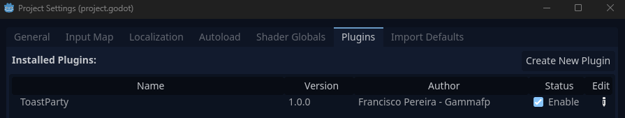

# Toast Party

Have fun with this marvelous plugin for generating small toast notifications.

Plugin created by Francisco Pereira Alvarado ([gammafp](https://twitter.com/gammafp)).

Please follow me on my social networks to follow my jobs: [LINKTREE](https://linktr.ee/gammafp)


## Installation:
1. Clone this repository into addons folder.
2. Enabled ToastParty, go to: Porject > Project Settings > Plugins



## Use:
ToastParty is an autoload singleton and should be used as follows:

```python 
> ToastParty.show({
    "text": "🥑Some Text🥑",       # Text (emojis can be admit)
    "bgcolor": Color(0, 0, 0, 0.7), # Background Color
    "color": Color(1, 1, 1, 1),     # Text Color
    "gravity": "top",               # top or bottom
    "direction": "right",           # left or center or right
})
```

## License
Copyright (c) 2023 Francisco Pereira Alvarado (gammafp)

Unless otherwise specified, files in this repository are licensed under the MIT license. See [LICENSE.md](LICENSE.md) for more information.